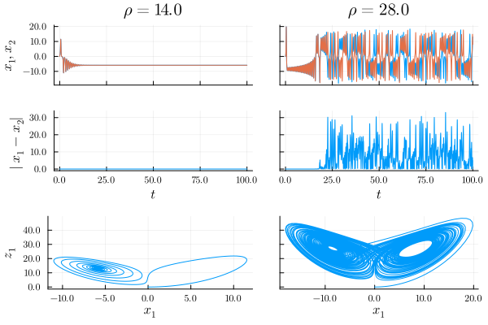

# Project 1


The Lorenz equations show deterministic non-periodic behavior, or chaos.  One aspect of this behavior is the system's sensitive dependence on initial conditions, which has been termed "the butterfly effect", and has been discussed and used in many books and movies.  The Lorenz equations are:

$$
   \frac{{\rm d}x(t)}{{\rm d}t} = \sigma (y(t) -x(t)), \\
   \frac{{\rm d}y(t)}{{\rm d}t} = x(t) (\rho - z(t)) - y(t), \\
   \frac{{\rm d}z(t)}{{\rm d}t} = x(t)y(t) - \beta z(t)
$$

where $\sigma, \rho$ and $\beta$ are constants, $x, y$, and $z$ are dependent variables and $t$ is time.  In this problem you will integrate the Lorenz equations in time for different values of $\rho$ and different initial conditions in order to see the butterfly effect for yourself.

1. Complete the Julia function `lorenz_solver(x₀, ρ)` to integrate the Lorenz equations with different initial conditions.  The values of $\sigma$, $\beta$ are fixed at $\sigma=10$, $\beta=8/3$.  The initial conditions vector is $[x_0, 1, 0]$.  `x₀`, `ρ` are arguments to the function.  The function should return an `ODESolution` (the thing returned by the [DifferentialEquations.jl](https://diffeq.sciml.ai/stable/) `solve()` function).  

1. Set $\rho =14$ and integrate the Lorenz equation twice, with $x_0 = 0$, and then with $x_0 = 1 \times 10^{-5}$.  Use subscript $1$ for the result when $x_0 = 0$ and subscript $2$ for the result when $x_0 = 1 \times 10^{-5}$ .  For this value of $\rho$, the behavior of the system is called a stable limit cycle.
 
   Using [Plots.jl](https://docs.juliaplots.org/stable/), make three plots:

     a. $x_1(t)$ and $x_2(t)$ as a function of $t$ 
    
     b. the absolute value of the difference $x_1(t) - x_2(t)$ as a function of $t$

     c. $z_1$ as a function of $x_1$, which is called a phase plot

1. Repeat Step 2 above with $\rho = 28$.  For the value of $\rho$, the behavior of the system is called a strange attractor.  The second plot of the absolute value of the difference of $x_1(t) - x_2(t)$ demonstrates the butterfly effect.

1. Complete the function `plot_lorenz()` so that 2 and 3 above automatically (without any arguments) create the following plot.

   
   
   **Hints:**
   
    * Note that the top two rows and columns of subplots share x and y axis and gridlines (same for the bottom row).  **DO NOT** set the tick and/or grid lines manually.  Use the plot attribute `link` to "tie" the plots together.
    
    * Do not explicitly set the plot line colors or overall figure size, use the defaults.
    
    * Use $\LaTeX$ labels.
    
    * Each row of plots should be 1/3 of the overall figure size, each column should be 1/2 of the overall figure size.

## Testing

To see if you answers are correct, run the following command at the Terminal
command line from the repository's root directory

```bash
julia --project=. -e "using Pkg; Pkg.test()"
```

the tests will run and report if passing or failing.
